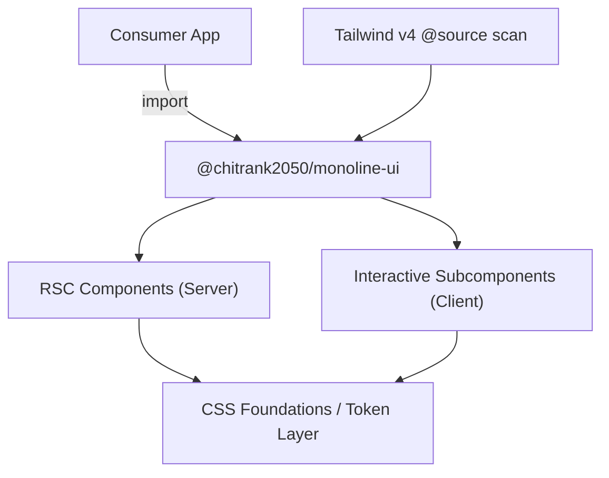

<div align="center">
  <h1>monoline-ui</h1>

  <p>A monochrome-first, layout-focused React component library.<br/>
  Zero dark-mode gymnastics. Built for React 19, Next.js App Router, and Tailwind CSS v4.</p>

  <p>
    <a href="https://www.npmjs.com/package/@chitrank2050/monoline-ui">
      
    </a>
    <a href="https://github.com/chitranklabs/monoline-ui/actions/workflows/ci.yml">
      
    </a>
    <a href="./LICENSE">
      
    </a>
  </p>

  <a href="https://ko-fi.com/D1D71U581P" target="_blank">
    
  </a>

  <br/>
  <br/>

[Features](#features) • [Quick Start](#quick-start) • [Architecture](#architecture) • [Setup](#setup--integration) • [Contributing](#contributing)

  <br/>
</div>

Monoline UI is a component library for developer sites, editorial interfaces, and documentation playgrounds where layout precision matters more than color variety. Every component ships monochrome by default — no dark-mode class gymnastics, no color-token sprawl.

---

## Why Monoline UI

> [!TIP]
> Most UI libraries are built around color themes. Monoline is built around **layout**. If you're building a portfolio, a docs site, or an editorial UI, you don't need 40 color scales — you need components that compose cleanly, render on the server, and ship zero client JavaScript unless you ask for it.

---

## Features <a id="features"></a>

| Feature                   | Description                                                             |
| :------------------------ | :---------------------------------------------------------------------- |
| ⚫ **Monochrome-first**   | Zero dark-mode overhead. One set of tokens, works everywhere.           |
| 🚀 **RSC-native**         | All compound components are Server Components by default.               |
| ⚡ **0kb client JS**      | Static layouts hydrate nothing. Client code is opt-in per subcomponent. |
| 🔗 **Link polymorphism**  | Three-level routing control: global, per-link, and `asChild`.           |
| 🌲 **Tree-shakeable ESM** | Import only the components you use. No barrel-file bloat.               |
| 🎛️ **Token-driven**       | Customize spacing, scale, and type via CSS custom properties.           |
| 📦 **37+ components**     | From `Avatar` to `Toc` — layout primitives for real projects.           |
| 🌊 **Tailwind CSS v4**    | First-class `@source` scanning — only used utilities ship.              |

---

## Quick Start <a id="quick-start"></a>

```bash
pnpm add @chitrank2050/monoline-ui
```

```tsx
import { Footer } from "@chitrank2050/monoline-ui/footer"
import "@chitrank2050/monoline-ui/theme.css"

export default function Page() {
	return (
		<Footer size="md">
			<Footer.Status>Available for contracts</Footer.Status>
			<Footer.Subscribe action={subscribeAction} />
		</Footer>
	)
}
```

---

## Documentation & Links

| Resource       | URL                                                                                                    |
| :------------- | :----------------------------------------------------------------------------------------------------- |
| **npm**        | [npmjs.com/package/@chitrank2050/monoline-ui](https://www.npmjs.com/package/@chitrank2050/monoline-ui) |
| **Repository** | [github.com/chitranklabs/monoline-ui](https://github.com/chitranklabs/monoline-ui)                     |
| **Changelog**  | [CHANGELOG.md](./CHANGELOG.md)                                                                         |

---

## Tech Stack

| Layer               | Technology             | Version     |
| :------------------ | :--------------------- | :---------- |
| **Runtime**         | Node.js                | `>=22.14.0` |
| **Package Manager** | pnpm                   | `11.8.0`    |
| **Framework**       | Next.js (App Router)   | `^16`       |
| **UI Runtime**      | React                  | `^19`       |
| **Compiler**        | TypeScript             | `^6.0`      |
| **Styling**         | Tailwind CSS + PostCSS | `^4`        |
| **Bundler**         | tsup (ESM)             | `^8`        |

---

## Technical Specification

- **Module format**: ESM-only (`"type": "module"`)
- **Target**: ES2022 / Bundler module resolution
- **Peer dependencies**: `react ^19`, `next ^16`, `tailwindcss ^4`
- **Runtime dependencies**:
  - `@radix-ui/react-slot` — polymorphic render delegation (0kb when static)
  - `clsx` + `tailwind-merge` — class composition
- **Performance invariant**: Static server-rendered layouts ship **0kb hydration overhead**

---

## Architecture <a id="architecture"></a>



**Flat single-package architecture** — no workspace sync, no symlink resolution overhead.

```text
monoline-ui/
├── app/                    ← Next.js playground & documentation
├── src/
│   ├── components/         ← 37+ UI components (Avatar, Button, Footer…)
│   └── foundations/        ← CSS layers, design tokens, breakpoints
├── scripts/
│   └── build-lib.mjs       ← ESM bundling script
├── package.json
└── tsconfig.json
```

> [!IMPORTANT]
> `/app` and `/src` coexist in a single package. The playground and the library share the same `package.json` — no monorepo overhead.

---

## Setup & Integration

### 1. Tailwind CSS v4

In your root stylesheet, point Tailwind's compiler at the compiled Monoline outputs so only used utilities ship:

```css
@import "tailwindcss";

/* Scan compiled outputs — only used utilities ship */
@source "node_modules/@chitrank2050/monoline-ui/dist/**/*.{js,mjs}";

/* Design tokens and CSS custom properties */
@import "@chitrank2050/monoline-ui/theme.css";
```

---

### 2. Composable Dot-Notation (RSC)

> [!IMPORTANT]
> Compound components are **Server Components by default**. Client interactivity is scoped to specific subcomponents — static layouts pay zero hydration cost.

```tsx
import { Footer } from "@chitrank2050/monoline-ui/footer"

export default function MyFooter() {
	return (
		<Footer size="md">
			<Footer.Status>Available for contracts</Footer.Status>
			<Footer.Subscribe action={subscribeFormAction} />
		</Footer>
	)
}
```

---

### 3. React 19 Server Actions

Pass a standard async Server Action to the `action` prop. No client JavaScript required:

```typescript
// app/actions.ts
"use server"

export async function subscribeFormAction(formData: FormData) {
	const email = formData.get("email")
	await db.newsletter.create({ data: { email } })
}
```

---

### 4. Link Polymorphism

Monoline supports three levels of client-router control:

**A. Global** — pass your router's `Link` once to override all internal links:

```tsx
import Link from "next/link"

;<Footer linkComponent={Link} columns={myColumns} />
```

**B. Per-link** — override individual links in the config array:

```tsx
import Link from "next/link"

const columns = [
	{
		title: "Navigate",
		links: [
			{ label: "Blog", href: "/blog", as: Link },
			{ label: "Twitter", href: "https://x.com", external: true },
		],
	},
]
```

**C. `asChild`** — composable override using the Radix slot pattern:

```tsx
import Link from "next/link"

;<Footer.Link asChild>
	<Link href="/about">About</Link>
</Footer.Link>
```

---

## Development Commands

```bash
pnpm install           # Install dependencies
pnpm dev               # Launch Next.js dev server (HMR)
pnpm build             # Build the Next.js playground
pnpm build:lib         # Bundle the component library into /dist
pnpm build:all         # Both builds in sequence
pnpm test              # Run Vitest test suite
pnpm typecheck         # TypeScript type check (no emit)
pnpm lint              # ESLint + Markdownlint
pnpm format            # Prettier
```

---

## Release Process

Monoline uses a two-phase release pipeline powered by **[git-hygiene](https://github.com/chitranklabs/git-hygiene)**:

1. **Prepare** — run the `Release 1 - Prepare PR` workflow. Bumps the version, updates `CHANGELOG.md`, opens a PR.
2. **Finalize** — merge the PR. `Release 2 - Finalize Tag` tags the release, creates a GitHub Release, and publishes to npm.

---

## Contributing <a id="contributing"></a>

Contributions are welcome. Please read the [Contributing Guide](./CONTRIBUTING.md) before opening a PR. All commits are validated by [git-hygiene](https://github.com/chitranklabs/git-hygiene) and must follow the [Conventional Commits](https://www.conventionalcommits.org) spec.

---

## Community & Support

- **Security**: See [SECURITY.md](./SECURITY.md) for reporting vulnerabilities.
- **Conduct**: We follow the [Contributor Covenant](./CODE_OF_CONDUCT.md).
- **Support**: If you use Monoline UI in your project, a star or credit is appreciated. ✨

---

## Security & Quality

- **Secret Scanning**: Gitleaks prevents credential leaks in every commit.
- **Workflow Auditing**: Zizmor ensures GitHub Actions follow security best practices.
- **Supply Chain**: All GitHub Actions are pinned to secure commit SHAs.

---

<p align="center">
  Developed with ❤️ by <b><a href="https://www.chitrankagnihotri.com">Chitrank Agnihotri</a></b>
</p>
