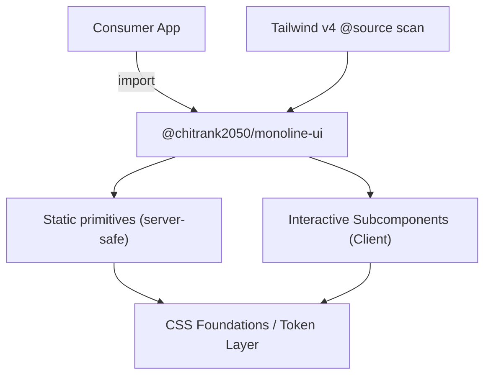

<div align="center">
  
  <br/>
  <br/>
  <h1>monoline-ui</h1>

  <p>Monochrome React components for developer portfolios, documentation, and editorial interfaces.<br/>
  Built with typed subpath exports and Tailwind CSS v4 design tokens.</p>

  <p>
    <a href="https://www.npmjs.com/package/@chitrank2050/monoline-ui">
    
    </a>
    <a href="https://jsr.io/@chitrank2050/monoline-ui">
    
    </a>
  </p>

  <p>
    <a href="https://github.com/chitranklabs/monoline-ui/actions/workflows/ci.yml">
      
    </a>
    <a href="https://github.com/chitranklabs/monoline-ui/actions/workflows/scorecard.yml">
      
    </a>
    <a href="https://scorecard.dev/viewer/?uri=github.com/chitranklabs/monoline-ui">
      
    </a>
    <a href="./LICENSE">
      
    </a>
  </p>

  <a href="https://ko-fi.com/D1D71U581P" target="_blank">
    
  </a>

  <br/>
  <br/>

[Features](#features) • [Quick Start](#quick-start) • [Architecture](#architecture) • [Setup](#setup--integration) • [Contributing](#contributing)

  <br/>
</div>

Monoline UI is a monochrome component library for developer sites, editorial interfaces, and documentation playgrounds. Its small token set keeps the emphasis on type, spacing, and layout, and can be adapted without maintaining separate light and dark utility classes.

---

## Why Monoline UI

> [!TIP]
> Monoline UI focuses on the parts of developer portfolios and documentation sites that tend to be rebuilt from scratch: editorial layout, navigation, code examples, project summaries, and supporting metadata. The package exposes typed components through explicit server and client entrypoints.

---

## Features <a id="features"></a>

| Feature                              | Description                                                                   |
| :----------------------------------- | :---------------------------------------------------------------------------- |
| ⚫ **Monochrome-first**              | A compact grayscale token set shared by light and dark themes.                |
| 🚀 **Server-safe static primitives** | Presentational entrypoints can render without a Monoline client boundary.     |
| ⚡ **Explicit client components**    | Interactive entrypoints declare client runtime behavior in their source/docs. |
| 🔗 **Link polymorphism**             | Configure routing globally, per link, or through `asChild`.                   |
| 🌲 **Direct ESM subpaths**           | Import components through explicit package entries.                           |
| 🎛️ **Token-driven**                  | Customize spacing, scale, and type via CSS custom properties.                 |
| 📦 **47 components**                 | Each component has a live preview, typed API, and implementation notes.       |
| 🌊 **Tailwind CSS v4**               | `@source` scanning includes utilities used by installed components.           |

---

## Quick Start <a id="quick-start"></a>

```bash
pnpm add @chitrank2050/monoline-ui
```

```tsx
import { Footer } from "@chitrank2050/monoline-ui/footer"
import "@chitrank2050/monoline-ui/theme.css"

export default function Page() {
	return (
		<Footer size="md">
			<Footer.Status>Available for contracts</Footer.Status>
			<Footer.Subscribe action={subscribeAction} />
		</Footer>
	)
}
```

---

## Documentation & Links

| Resource           | URL                                                                                                                   |
| :----------------- | :-------------------------------------------------------------------------------------------------------------------- |
| **Docs**           | [monolineui.chitrankagnihotri.com](https://monolineui.chitrankagnihotri.com)                                          |
| **Components**     | [47 interactive React references](https://monolineui.chitrankagnihotri.com/docs/components)                           |
| **Blocks**         | [Five installable portfolio compositions](https://monolineui.chitrankagnihotri.com/docs/blocks)                       |
| **Foundations**    | [Tailwind CSS v4 design tokens](https://monolineui.chitrankagnihotri.com/docs/foundations)                            |
| **Patterns**       | [Component composition recipes](https://monolineui.chitrankagnihotri.com/docs/patterns)                               |
| **Accessibility**  | [Behavior and consumer responsibilities](https://monolineui.chitrankagnihotri.com/docs/accessibility)                 |
| **Theming**        | [Light, dark, system, and token overrides](https://monolineui.chitrankagnihotri.com/docs/theming)                     |
| **Compatibility**  | [React, Next.js, Tailwind, and browser support](https://monolineui.chitrankagnihotri.com/docs/compatibility)          |
| **Installation**   | [React and Tailwind CSS v4 setup](https://monolineui.chitrankagnihotri.com/docs/installation)                         |
| **npm**            | [npmjs.com/package/@chitrank2050/monoline-ui](https://www.npmjs.com/package/@chitrank2050/monoline-ui)                |
| **JSR**            | [jsr.io/@chitrank2050/monoline-ui](https://jsr.io/@chitrank2050/monoline-ui)                                          |
| **Repository**     | [github.com/chitranklabs/monoline-ui](https://github.com/chitranklabs/monoline-ui)                                    |
| **Block requests** | [Request a registry composition](https://github.com/chitranklabs/monoline-ui/issues/new?template=registry_request.md) |
| **Case study**     | [Architecture and project outcomes](https://chitrankagnihotri.com/project/monoline-ui)                                |
| **Changelog**      | [CHANGELOG.md](./CHANGELOG.md)                                                                                        |

---

## Tech Stack

| Layer               | Technology             | Version     |
| :------------------ | :--------------------- | :---------- |
| **Runtime**         | Node.js                | `>=24.14.0` |
| **Package Manager** | pnpm                   | `11.18.0`   |
| **Framework**       | Next.js (App Router)   | `^16`       |
| **UI Runtime**      | React                  | `^19`       |
| **Compiler**        | TypeScript             | `^6.0`      |
| **Styling**         | Tailwind CSS + PostCSS | `^4`        |
| **Bundler**         | tsup (ESM)             | `^8`        |

---

## Technical Specification

- **Module format**: ESM-only (`"type": "module"`)
- **Target**: ES2022 / Bundler module resolution
- **Peer dependencies**: `react ^18.2 || ^19`, `react-dom ^18.2 || ^19`, optional `tailwindcss >=4`
- **Runtime dependencies**:
  - Radix UI primitives - dialog, popover, menu, tooltip, and form-control behavior
  - `@radix-ui/react-slot` - polymorphic render delegation
  - `clsx` + `tailwind-merge` - class composition
  - `cmdk` - command palette interaction model
- **Performance invariant**: Static component subpaths do not introduce a Monoline client boundary. The mixed root barrel is client-safe because it also exports interactive components; use documented component subpaths for RSC optimization.

---

## Architecture <a id="architecture"></a>



**Flat single-package architecture** - no workspace sync, no symlink resolution overhead.

```text
monoline-ui/
├── app/                    ← Next.js playground & documentation
├── registry/               ← Installable Monoline-native compositions
├── registry.json           ← GitHub registry contract
├── src/
│   ├── components/         ← 47 UI components (Avatar, Button, Footer…)
│   └── foundations/        ← CSS layers, design tokens, breakpoints
├── scripts/
│   └── build-lib.mjs       ← ESM bundling script
├── package.json
└── tsconfig.json
```

> [!IMPORTANT]
> `/app` and `/src` coexist in a single package. The playground and the library share the same `package.json` - no monorepo overhead.

---

## Setup & Integration

### 1. Tailwind CSS v4

In your root stylesheet, point Tailwind's compiler at the compiled Monoline outputs so only used utilities ship:

```css
@import "tailwindcss";
@import "@chitrank2050/monoline-ui/theme.css";
```

The published theme registers Monoline's compiled component sources with Tailwind, so consumers do not need to maintain a package-specific `@source` path.

---

### 2. Server and client runtime boundaries

> [!IMPORTANT]
> Static primitives can render without a Monoline client boundary. `Checkbox`, `CodeBlock`, `CommandSearch`, `Dialog`, `DropdownMenu`, `Label`, `Popover`, `Progress`, `RadioGroup`, `SegmentedControl`, `Select`, `Separator`, `ThemeSwitcher`, `Toc`, `Toggle`, and `Tooltip` require client JavaScript. The final bundle also depends on your application and passed children.

Import static primitives from their component subpaths to preserve that boundary. The root package export intentionally remains client-safe because it mixes static and interactive exports.

```tsx
import { Footer } from "@chitrank2050/monoline-ui/footer"

export default function MyFooter() {
	return (
		<Footer size="md">
			<Footer.Status>Available for contracts</Footer.Status>
			<Footer.Subscribe action={subscribeFormAction} />
		</Footer>
	)
}
```

---

### 3. React 19 Server Actions

Pass a standard async Server Action to the `action` prop. No client JavaScript required:

```typescript
// app/actions.ts
"use server"

export async function subscribeFormAction(formData: FormData) {
	const email = formData.get("email")
	await db.newsletter.create({ data: { email } })
}
```

---

### 4. Link Polymorphism

Monoline supports three levels of client-router control:

**A. Global** - pass your router's `Link` once to override all internal links:

```tsx
import Link from "next/link"

export default function MyFooter() {
	return <Footer linkComponent={Link} columns={myColumns} />
}
```

**B. Per-link** - override individual links in the config array:

```tsx
import Link from "next/link"

const columns = [
	{
		title: "Navigate",
		links: [
			{ label: "Blog", href: "/blog", as: Link },
			{ label: "Twitter", href: "https://x.com", external: true },
		],
	},
]
```

**C. `asChild`** - composable override using the Radix slot pattern:

```tsx
import Link from "next/link"

;<Footer.Link asChild>
	<Link href="/about">About</Link>
</Footer.Link>
```

---

## Development Commands

```bash
pnpm install           # Install dependencies
pnpm dev               # Launch Next.js dev server (HMR)
pnpm build             # Build the Next.js playground
pnpm build:lib         # Bundle the component library into /dist
pnpm build:all         # Both builds in sequence
pnpm test              # Run Vitest test suite
pnpm typecheck         # TypeScript type check (no emit)
pnpm lint              # ESLint + Markdownlint
pnpm format            # Prettier
```

---

## Release Process

Monoline uses a two-phase release pipeline powered by **[git-hygiene](https://github.com/chitranklabs/git-hygiene)**:

1. **Prepare** - run the `Release 1 - Prepare PR` workflow. Bumps the version, updates `CHANGELOG.md`, opens a PR.
2. **Finalize** - merge the PR. `Release 2 - Finalize Tag` tags the release, creates a GitHub Release, and publishes to npm.

---

## Contributing <a id="contributing"></a>

Contributions are welcome. Please read the [Contributing Guide](./CONTRIBUTING.md) before opening a PR. All commits are validated by [git-hygiene](https://github.com/chitranklabs/git-hygiene) and must follow the [Conventional Commits](https://www.conventionalcommits.org) spec.

---

## Community & Support

- **Security**: See [SECURITY.md](./SECURITY.md) for reporting vulnerabilities.
- **Conduct**: We follow the [Contributor Covenant](./CODE_OF_CONDUCT.md).
- **Support**: If you use Monoline UI in your project, a star or credit is appreciated. ✨

---

## Security & Quality

- **Secret Scanning**: Gitleaks prevents credential leaks in every commit.
- **Workflow Auditing**: Zizmor ensures GitHub Actions follow security best practices.
- **Supply Chain**: All GitHub Actions are pinned to secure commit SHAs.

---

<p align="center">
  Developed with ❤️ by <b><a href="https://chitrankagnihotri.com">Chitrank Agnihotri</a></b>
</p>
