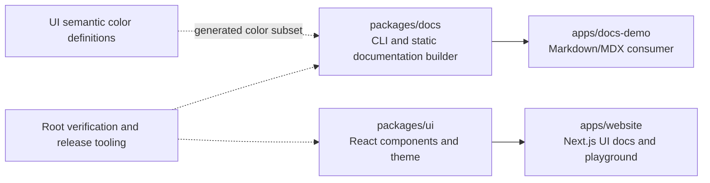
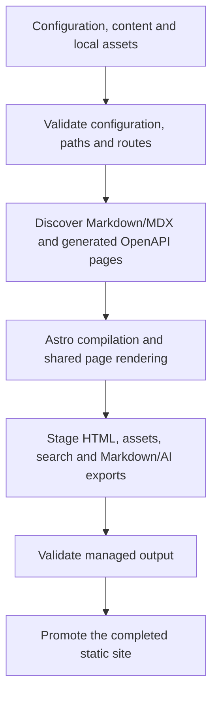

# Monoline architecture

Monoline keeps its React component library and static documentation builder in
one repository to share a design language and development tooling. Their runtime
APIs and release pipelines remain independent: using Docs does not require
installing the UI package or running a Next.js application.

## Packages and consumers

The dotted color relationship is a repository build input, not a consumer runtime
dependency. `packages/docs/sync-tokens.mjs` generates Docs color variables from
`packages/ui/src/foundations/theme/tokens.css`; the Docs build checks that the
committed subset is current. Each package ships its own required styles.

Both sites consume built package outputs. This exercises the public interfaces
instead of treating site-specific overrides as package features. The Docs demo
is also the source of the Docs consumer guides.

## Monoline UI runtime

UI exports React components through typed ESM subpaths and exposes its theme as
an explicit CSS import. Static component subpaths preserve server rendering;
interactive subpaths carry client directives. The mixed root entry includes
interactive exports and is a client boundary.

Consumers supply application routing, state and data. Monoline provides
composition and styling rather than an application backend. Follow the
[compatibility guide](https://monolineui.chitrankagnihotri.com/docs/compatibility)
for React support and server/client boundaries, and
[installation](https://monolineui.chitrankagnihotri.com/docs/installation) for
Tailwind setup. Astro authoring components from Docs are a separate API.

## Monoline Docs build pipeline

The production renderer and route manifest are shared by page rendering,
navigation, links, search, sitemap and exports. Ordinary pages produce static
HTML; React is optional and hydrates only explicitly authored islands. The local
preview rebuilds content and assets, while configuration changes require a
restart. There is no production SSR server to operate.

Builds validate managed output before promotion. Failure preserves the previous
successful output, and promotion leaves unrelated output files alone. The
[recovery guide](docs-release.md#local-output-promotion-and-recovery) explains
boundaries and interrupted-promotion recovery.

Configuration and MDX are trusted executable input. Draft and discovery settings
control generated output; they do not provide authentication for published pages.
See [support and limitations](../apps/docs-demo/content/support.md) and
[deployment](docs-deployment.md) before publishing.

## Verification boundaries

| Layer                 | What it verifies                                                                           | Entry point          |
| :-------------------- | :----------------------------------------------------------------------------------------- | :------------------- |
| Shared checks         | Export drift, formatting, lint, types, tooling and unit tests                              | `pnpm check:static`  |
| UI package            | Packed consumers, React compatibility, RSC imports and theme CSS                           | `pnpm check:package` |
| UI website            | Built documentation, SEO, browser behavior and accessibility                               | `pnpm check:website` |
| Docs package and demo | Engine, npm/pnpm consumers, production browser behavior, visual comparisons and demo build | `pnpm check:docs`    |

Packed consumers use installed tarballs independently of workspace imports.
Stable Docs fixtures verify behavior without depending on demo prose. Visual
baselines compare representative layouts in both themes at mobile and desktop
widths; they are repository test assets and do not ship in npm packages.

CI selects checks by the owning workspace and shared dependencies. Root and site
changes do not all require the same work. Read
[CI selection](../CONTRIBUTING.md#ci-selection-and-maintenance) before changing
filters and [visual regression checks](docs-release.md#visual-regression-checks)
before intentionally updating screenshot baselines.

## Independent releases

UI and Docs use separate Changesets intent, version preparation and finalization.
UI tags use `vX.Y.Z` and target npm/JSR; Docs tags use `docs-vX.Y.Z` and target npm.
A consumer-site-only change does not require a package release.

[UI release operations](releases.md) and [Docs release operations](docs-release.md)
are authoritative for publication and retry procedures. Local checks do not
establish hosted credentials, provenance, real-device accessibility or deployment
acceptance. The [Docs roadmap](../packages/docs/ROADMAP.md) retains outstanding
release gates.
