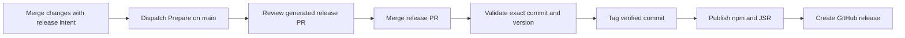

# Library releases

Changesets makes library release intent explicit now that UI and the private
website are separate workspaces. A website fix must not become a library patch.
Git-hygiene remains responsible for branch names and conventional commits;
git-cliff no longer generates new releases. Its configuration is retained for
historical reference, not as a second active release pipeline.

## Sources of truth

| Surface                   | Owner                                                            |
| ------------------------- | ---------------------------------------------------------------- |
| Pending library changes   | Committed `.changeset/*.md` files                                |
| Library version           | `packages/ui/package.json`, versioned by Changesets              |
| JSR version               | Synchronized from the Changesets plan during preparation         |
| Future release notes      | `packages/ui/CHANGELOG.md`                                       |
| Website timeline and RSS  | Existing `GitCliffRelease[]` adapter, prepending new releases    |
| Old mixed release history | Root `CHANGELOG.md` and existing website JSON entries, preserved |

The root and website are private and are not versioned or published. Existing
`v0.4.0` and older tags stay unchanged. This migration creates no new version.

## Contributor workflow

For a user-visible UI change, run `pnpm changeset`, select
`@chitrank2050/monoline-ui`, choose patch/minor/major, and describe the consumer
impact. Commit the generated Markdown file with the implementation.

Use a clear first line, for example `fix(select): Preserve focus after closing.`
Conventional prefixes supply the website's semantic groups. Additional paragraphs
belong in the package/GitHub release notes; the current timeline displays the
headline. A major changeset marks its timeline entry as breaking. Commit SHAs and
author names come from Git; the adapter does not guess PR numbers or GitHub handles.

Website, test, and CI-only work needs no library changeset. An explicit no-release
decision can be recorded with `pnpm changeset --empty`. A library runtime dependency
update still needs a changeset even when application source did not change.

Use `pnpm release:status` to inspect pending intent. The underlying Changesets CLI
can exit nonzero when library files differ from `main` but no changeset exists;
that is a request to review release intent, not an automatic version bump.

## Maintainer workflow

1. Dispatch **Release 1 - Prepare PR** on `main`. No pending library changes means
   no release PR and no version mutation. Stable releases only are supported.
2. Review the consumed changesets, package version/changelog, synchronized JSR
   version, lockfile, and new website entry. Root historical notes are not regenerated.
3. Merge the generated `chore/release-vX.Y.Z` PR after required checks pass.
   Finalize checks out its exact merge commit for every source-consuming job.
   The requested tag, npm manifest, JSR manifest, and prepared release notes must agree.
   If newer changesets land, rerun Prepare and review its updated PR before merging;
   Finalize refuses to publish with unconsumed changesets.
4. Finalize validates static checks, package consumers, and the production website
   build before tagging. GitHub release creation waits for both registries and uses
   only the prepared package notes, not a new Git history scan.

Do not use `changeset publish` directly: it does not run the repository's JSR job
or verification gates. `pnpm release:version` is a mutating preparation command,
intended for the Prepare workflow; running it locally consumes pending changesets.

## Failure recovery and boundaries

- If one registry fails after the other succeeds, use GitHub's **Re-run failed jobs**
  on that same run. Do not re-run successful publication jobs or move an existing tag.
- Manual Finalize dispatch requires `main` and an exact prepared `vX.Y.Z`. It is not
  a way to publish arbitrary historical versions from current source. An existing
  tag pointing to another commit is rejected.
- Preparation requires committed changesets for attribution. It rejects prerelease
  mode, JSR version drift, duplicate timeline versions, and additional publishable
  packages before versioning. A failed local generation may leave partial generated
  files; inspect the diff rather than committing it blindly.
- Existing bot permissions, npm credentials, and JSR authentication remain unchanged.
  No secrets, remote settings, tags, or packages are changed by this migration itself.
- New public packages need explicit publishing and tag policies before this adapter
  accepts them. Changesets supports a larger workspace; our current publisher supports
  only the UI package. Changelog UI redesign, registry, and blocks remain separate work.

CI tests exercise the real Changesets CLI in temporary Git workspaces, including
no-release work, attribution, historical preservation, duplicate summaries, and
rejected version mismatches. They do not publish to either registry.

## References

- [Changesets configuration](https://changesets.dev/guide/config)
- [Changesets CLI](https://changesets.dev/guide/cli)
