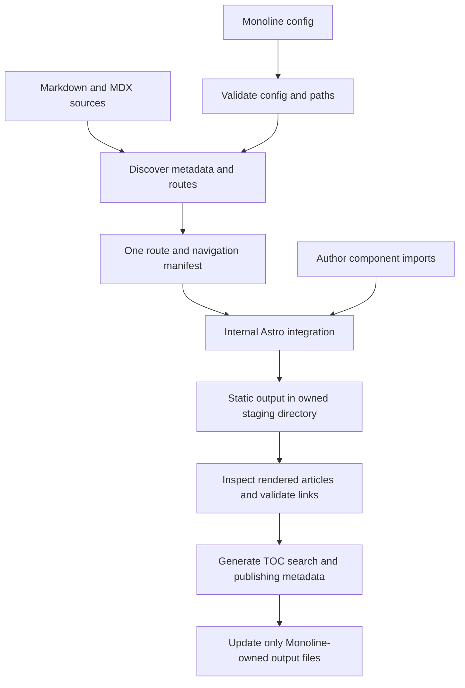

# Monoline Docs: Astro engine integration

Status: engine choice approved; integration design proposed for review.
Date: September 14, 2026.

## Purpose and scope

Make Monoline Docs a static-first MDX documentation product, with Ask Widget as
the first external migration target. Astro supplies compilation, component
rendering, bundling, and selective hydration. Monoline owns design, configuration,
navigation, content rules, search, and output safety.

This is not a Starlight theme. A basic site needs `monoline-docs.yml` and content,
not an Astro config, custom layout, or React entry point. Preserve the working
Markdown product while adding MDX. No publication, deployment, main-website
migration, or registry/blocks work is part of the engine integration.

## Evidence and decision

The temporary experiment used Astro 7.3.2, MDX integration 8.0.1, React integration
6.0.5, React 19.3.0, and Ask Widget 0.6.1 on Node 24.14.0. Both a custom compiler
prototype and Astro rendered static MDX and an API table with 12 extracted props
without page JavaScript. Both passed browser checks for opening the widget,
sending a message, and closing it under `/ask-widget/`.

The custom demo used 73,086 bytes of gzip-compressed JavaScript. Astro used
72,819 bytes for external scripts plus 1,929 bytes for inline bootstrap. These
are individually compressed prototype payloads, not production network budgets.
Neither prototype included the complete Monoline shell, search, or validation.

Choose Astro for its existing rendering and hydration machinery, not a proven
bundle-size advantage. The custom prototype hydrated the entire demo article;
Astro hydrated the widget only. Maintaining our own equivalent would create
another framework inside Docs.

Astro's programmatic API is marked experimental in the tested release. Keep its
use in one internal module, pin compatible versions initially, and test upgrades
through a packed consumer. Use public exports, not private `astro/dist/*` paths.
Do not expose an engine toggle or maintain two production rendering engines.

## Ownership and data flow

The route manifest is build-local data, not a registry package. Source paths,
public routes, metadata, and navigation positions feed rendering, previous/next
links, search, sitemap, and validation from one source of truth.

Use an internal Astro integration with injected routes and a build-local module
of explicit content imports. Resolve imports from their authoring files, never
from an assumed monorepo layout. Set `configFile: false`, static output, and a
private engine source directory so a consumer's existing `src/pages` and
`astro.config.*` are not incorporated accidentally.

Do not generate source inside `node_modules` or copy user components into the
package. Disposable engine files belong in owned temporary directories. Reuse
existing pure configuration, navigation, asset, and safety logic; no generic
adapter framework or additional package is needed.

## Public contracts to preserve

| Contract                        | Requirement                                                                 |
| ------------------------------- | --------------------------------------------------------------------------- |
| `monoline-docs build` and `dev` | Same commands and flags; reject unknown flags                               |
| YAML/module configuration       | Same discovery checks and config-relative paths                             |
| `defineConfig`, `loadConfig`    | Existing options and runtime validation remain valid                        |
| `buildDocs(config)`             | Retain `pages` and `outDirectory` result fields                             |
| `startDevServer(config, port)`  | Retain `url`, `rebuild()`, `close()`, and API port zero                     |
| Metadata                        | Required title; description, order, and draft retain their meanings         |
| Markdown                        | Existing `.md` examples work; raw HTML stays escaped in `.md`               |
| Routing                         | Directory-index output, root/subpath support, duplicate-route rejection     |
| Themes                          | Light/dark/system, persistence, pre-style theme selection, custom CSS last  |
| Publishing                      | Production excludes drafts; indexing and drafts remain independent          |
| Errors                          | Source context, nonzero CLI failure, no successful-build message on failure |

Keep public discovery/navigation exports. Do not leak Astro types into existing
configuration or build results. Preserve existing heading anchors through fixtures
covering Unicode, inline code, duplicate headings, and the reserved `content` ID;
Astro's default slug generation is not automatically an equivalent replacement.

## MDX and component contract

Support `.md` and `.mdx` together. Ask Widget may use only MDX without forcing
existing users to convert. `api.md` and `api.mdx` must fail as duplicate routes.
Imported helpers belong outside the page content directory; its files are pages,
not an implicit component registry.

MDX supports local and installed component imports, JSX, and build-time
expressions. MDX and module configuration are trusted executable project code,
not sandboxes for submitted or remotely fetched content. No remote-code execution
feature is included.

The shell owns H1. Preserve existing Markdown H1-to-H2 normalization and teach
new authors to start their body at H2. Monoline's basic documentation components
render statically and do not require React hydration.

React examples use direct MDX imports and explicit `client:load`, `client:idle`,
or `client:visible` directives. Without a directive, a component renders statically;
event handlers do not become active automatically. Browser-only rendering is
outside the first supported contract. Prefer SSR-safe wrappers and give a clear
error when a component cannot render on the server.

Add a validated `react: true` option to enable the internal React integration.
Ship the integration as build tooling; require compatible consumer React and
React DOM peers for React examples and document installation. Default pages must
not download React, even if the package manager installs peers. Verify strict
pnpm and npm consumer resolution without duplicate React runtimes. Initially
verify React 19, rather than claiming every major supported by the integration.

Direct imports are enough for the first extension API. Do not add a global
registration file, arbitrary plugins, or layout replacement before a real consumer
requires them.

## Rendered content, anchors, and search

Markdown AST extraction alone misses tables created by imported components.
Inspect rendered static article HTML with a real HTML parser, declared as a direct
dependency if used. Do not parse HTML using regular expressions.

Extract headings, static IDs, and searchable text from the article, not the entire
document. Exclude navigation, footer, scripts, styles, code blocks, permalink
labels, and interactive islands. Static API tables are searchable. An explicit
`data-docs-search="exclude"` wrapper can suppress noisy static examples.

Generate Markdown heading IDs before rendering. Static custom-component headings
must supply stable IDs; reject missing or duplicate IDs that make TOC entries
ambiguous. Generate the final TOC outside the article from rendered headings.
Never rewrite HTML or IDs inside hydrated islands: server and client trees must
remain consistent. Interactive examples do not create TOC entries by default.

Preserve the search JSON shape and keyboard behavior. API descriptions must appear
in the index; imports and JSX syntax must not. Client-created text is not indexed.

Rewrite ordinary Markdown links through the route manifest during compilation,
preserving `.md`/`.mdx` links and fragments. Provide a base-aware link helper or
component for authored JSX. Validate rendered local links, assets, and fragments
before promotion, with source-route context. Do not repair island links by
rewriting their server HTML after rendering.

Keep the local asset contract and allowed external protocols. Treat engine
scripts/styles separately from user assets. Ordinary builds do not request remote
URLs to check whether external links exist.

## Output safety and preview

Astro builds into a newly created, owned staging directory, never directly into
the final output. Validate pages and generate search/publishing artifacts before
promotion.

Reuse Monoline's overlap, ownership, symlink, and untracked-file checks. Extend
the generated-file manifest for hashed engine assets while rejecting absolute
paths, traversal, invalid separators, and symlink targets. Read old manifests so
existing sites rebuild without deleting output manually. Remove only previously
recorded stale files.

Compilation or validation failure leaves the previous final output unchanged.
Promotion is not an atomic deployment transaction: filesystem errors must fail
visibly, and documentation must still say to deploy only successful builds.

Initially keep the existing loopback-only production-output preview and its
error/reload behavior. Rebuild through Astro; do not create another HMR system.
Track local imported component/data dependencies as well as content/assets so
editing an imported file triggers a rebuild. Do not watch all dependencies or
the entire filesystem.

Preserve Host validation, noindex, draft behavior, GET/HEAD handling, 404 status,
watcher shutdown, and last-good-page behavior. Configuration changes still require
restart. Full Astro development-server adoption is deferred until its access and
error behavior is verified; do not accidentally expose source through Vite.

## Design and configuration after engine parity

Keep one Monoline design and the generated UI-token subset. The shell uses Astro
components and small browser scripts, not a React application. Retain custom CSS,
mobile layout, long-table, keyboard, and light/dark checks.

The layout batch adds base-aware internal header links and a footer configuration
with text and labeled links. Then add collapsible sidebar groups, edit-page links,
and documented visibility controls without changing existing navigation data.
Use native semantic elements where they satisfy the interaction.

The authoring batch adds steps, link cards, tabs, package-manager code groups,
code filenames/highlights, and API-table presentation. They share typography,
spacing, borders, focus styles, and tokens. No theme marketplace, arbitrary layout
designer, or client-side docs router is included.

## Packaging and distribution

Keep `@monoline/docs` private until packed-consumer verification passes. Explicitly
package runtime Astro components, routes, styles, browser assets, CLI, and
declarations. Static output must not require an adapter or deployed Node process.

Pin the initial compatible engine versions. Preserve the Node minimum only if the
complete dependency set passes engine requirements and consumer tests. Do not
enable experimental engine flags without a demonstrated need. Remove Markdown-it
and Prism only after replacement parity, including escaped HTML in `.md`, callouts,
code rendering, and anchors.

npm is the first CLI distribution proof. JSR needs its own packaging/runtime check;
an npm tarball test does not prove JSR compatibility. Do not promise delivery of
Astro runtime files through JSR until a real consumer passes. Publication remains
a separate approval step.

## Reviewable implementation batches

| Batch                   | Work                                                                     | Gate                                                                                                                  |
| ----------------------- | ------------------------------------------------------------------------ | --------------------------------------------------------------------------------------------------------------------- |
| 1. Engine foundation    | Internal Astro invocation, packaged routes, static MD/MDX, staged output | Packed fixture needs no Astro config; unrelated consumer pages/config ignored; compilation failures leave output safe |
| 2. Contract parity      | Anchors, links, assets, TOC, search, metadata, themes, manifest          | Existing contracts verified; component API table searchable; failure preserves previous build                         |
| 3. React and preview    | Opt-in islands and dependency-aware preview rebuilds                     | Packed React example works at root/subpath; ordinary pages do not load React; no hydration/browser errors             |
| 4. Layout and authoring | Header/footer, sidebar, essential MDX components                         | Keyboard/mobile and light/dark visual review; documentation teaches implemented APIs                                  |
| 5. Ask Widget rehearsal | Convert content, generate API data, preserve URLs and auxiliary pages    | Packed external consumer builds without VitePress/Vue; all published pages accounted for; API changes update docs     |
| 6. Release readiness    | Performance, host recipes, distribution checks, release materials        | Representative measurements and explicit npm/JSR results; no publication without approval                             |

Work sequentially. A temporary internal test path may coexist during integration,
but no public engine toggle. Switch the CLI only after parity passes, then remove
the old renderer. Commits remain user-controlled; do not create PRs automatically.

### Required verification

- Retain config, metadata, navigation, asset, safety, and CLI checks.
- Cover root/nested MDX, imports, static tables, unknown components, invalid
  imports, duplicate IDs, and component-generated broken links.
- Cover last-good output, stale hashed assets, manifest tampering, symlink
  collisions, and unrelated-file retention.
- Browser-test root and `/ask-widget/`: no-JS reading, search keyboard behavior,
  themes, 404s, and draft exclusion.
- Check React interaction without shell hydration. Count requested scripts and
  inline bootstrap; default pages must not request React.
- Keep one targeted browser CI job. Docs-only changes must not build the Next.js
  website; share dependency and browser setup within the job.
- Re-run 100/1,000-page fixtures on the actual product: build time, output size,
  search index, browser search response, and preview rebuild delay. Report cold/
  warm runs and corpus/hardware limits. The stripped prototype is not a fair
  performance budget for the complete product.

Ask Widget 0.6.1's public TypeScript entry contains `export {}` while useful
declarations are nested deeper in its tarball. Correct that as separate Ask
Widget work before calling the migration a supported installation. The spike's
direct access to nested declarations is diagnostic, not a consumer API.

## References

- [Astro programmatic API](https://docs.astro.build/en/reference/programmatic-reference/)
- [Astro integration API](https://docs.astro.build/en/reference/integrations-reference/)
- [MDX integration](https://docs.astro.build/en/guides/integrations-guide/mdx/)
- [React integration](https://docs.astro.build/en/guides/integrations-guide/react/)
- [Client directives](https://docs.astro.build/en/reference/directives-reference/)
- [Current Docs contract](../../docs-prototype.md)
- [Performance methodology](../../docs-performance.md)

Framework signatures were also checked against the installed spike versions.
The temporary experiment is not production code and is not required by any
package or CI command.
